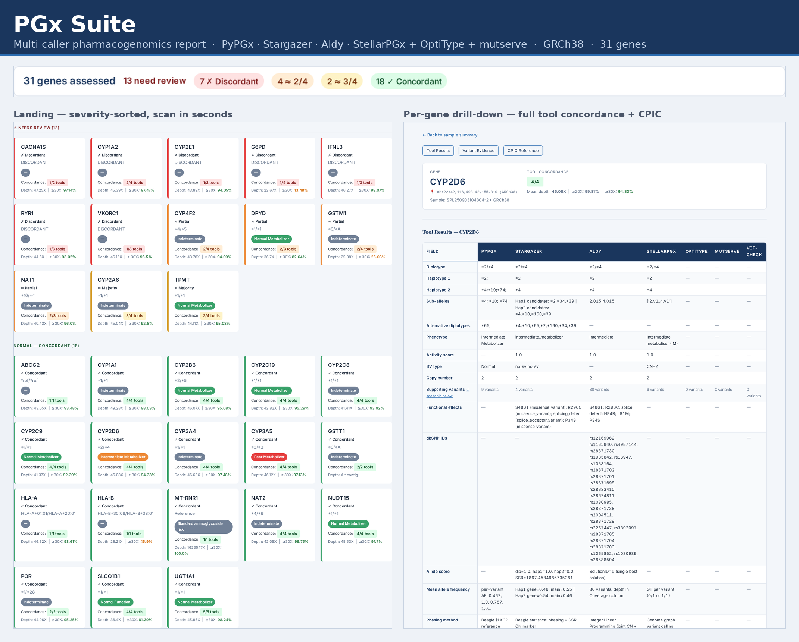

# PGx Suite

[](https://github.com/alvin8-git/pgx-suite/actions/workflows/test.yml)

-2ea043)


**PGx Suite genotypes pharmacogenomic star alleles from one WGS BAM/CRAM and produces a single self-contained HTML clinical report — one command in, one report out.** It runs **nine** PGx callers over **GRCh38**, covering **37 genes/loci (all 19 CPIC Level A)**, and reconciles them into **one verdict per gene** (`concordant` / `majority` / `discordant` / `no_call`).



### Why this, not a single caller

No single PGx tool gets every gene right — they disagree on structural variants, copy number, and allele nomenclature. PGx Suite runs the field's best callers together (PyPGx, Stargazer, Aldy, StellarPGx, Cyrius, PharmCAT, OptiType, mutserve, and the in-house VCF-Check) and resolves them with a clinical-grade authority model, not a naive majority vote:

- **A CPIC-reference method *is* the verdict** where star-allele callers fail — **Cyrius** for CYP2D6 (paralog / CNV / hybrids), **PharmCAT** for UGT1A1 / CYP2B6 / CYP4F2, **VCF-Check** for single-variant genes (RYR1, VKORC1, …). An authority, not an outvote.
- **Synonym-aware reconciliation** — the same allele written three ways (DPYD `*9A` = `c.85T>C` = `rs1801265`) counts once, so callers aren't flagged discordant over nomenclature.
- **Phenotype tier** — callers that print different diplotype strings but agree on the CPIC phenotype are concordant-by-phenotype.
- **ALT-aware safety gate** — detects a BAM aligned *without* ALT awareness (e.g. minimap2) and reports paralog/SV genes as **NO_CALL** instead of emitting a false CYP2D6 `*5` deletion. Most PGx tools don't check this; it silently breaks CYP2D6.
- **Coverage floor** — genes below the depth threshold report **NO_CALL**, never a wild-type guess.
- **One self-contained report** — per-gene "what the pipeline did" narrative, authority badges, and an orthogonal-validation panel. No server; open it anywhere.

### How accurate it is

- **TTSH clinical cohort** — 13 samples on Illumina + MGI (26 pairs) vs the Thermo Fisher Axiom PGx array: **73.0%** strict verdict-concordance, **85.8%** once array panel-gaps and single-SNP notation are adjudicated (cases where WGS is more sensitive or at parity — not pipeline errors). Illumina and MGI agree.
- **GIAB HG001 / NA12878** vs CDC **GeT-RM** consensus: **19/28** genes exact-match, 3 partial (nomenclature), 6 mismatch — residuals driven by GeT-RM-only sub-allele systems, not miscalls.
- Reconciled verdict reproduced across all genes on GIAB **HG002**.

Full method and per-gene breakdown: **[TTSHvalidation.md](TTSHvalidation.md)**.

Orchestration is a **[Snakemake](https://snakemake.readthedocs.io/) DAG** driven by one source-of-truth gene table (`docker/genes.tsv`); every caller runs as a **non-fatal rule** (one tool failing never aborts the gene or the batch) and `pgx-compare.py` is the single verdict authority. See [Architecture](#architecture) for the full reconciliation tiers.

> **License notice:** Stargazer and Aldy are restricted to non-commercial academic use.
> This image **must not be published to any public registry** (Docker Hub, GHCR, etc.).

---

## Table of Contents

- [Why this, not a single caller](#why-this-not-a-single-caller)
- [How accurate it is](#how-accurate-it-is)
- [Bundled Tools](#bundled-tools)
- [Requirements](#requirements)
- [Installation](#installation)
- [Usage](#usage)
  - [Host launcher — recommended](#host-launcher--recommended)
  - [Run all genes (Snakemake, manual docker)](#run-all-genes-snakemake-manual-docker)
  - [Run a single gene (debug)](#run-a-single-gene-debug)
  - [Volume mounts reference](#volume-mounts-reference)
  - [Expected output](#expected-output)
- [Gene Coverage](#gene-coverage)
- [Output Fields](#output-fields)
- [Architecture](#architecture)
- [Troubleshooting](#troubleshooting)
- [Repository Layout](#repository-layout)
- [Documentation](#documentation)
- [License](#license)

---

## Bundled Tools

| Tool | Version | Algorithm | Genes | License |
|------|---------|-----------|-------|---------|
| [PyPGx](https://github.com/sbslee/pypgx) | 0.26.0 | Bayesian / Beagle phasing | 88 | MIT |
| [Stargazer](https://stargazer.gs.washington.edu/stargazerweb/) | 2.0.3 | Bayesian / Beagle phasing | 58 | Non-commercial academic (UW) |
| [Aldy](https://github.com/0xTCG/aldy) | 4.8.3 | Integer Linear Programming | 39 | Non-commercial academic (IURTC) |
| [StellarPGx](https://github.com/SBIMB/StellarPGx) | 1.2.7 | Genome graph (graphtyper) | 21 | MIT |
| [Cyrius](https://github.com/Illumina/Cyrius) | vendored | Targeted CYP2D6 caller (SV/CNV/hybrid-aware) | CYP2D6 | PolyForm Strict (use only — do **not** redistribute the image) |
| [PharmCAT](https://github.com/PharmGKB/PharmCAT) | 3.2.0 | CPIC reference star-allele caller + named-allele matcher | UGT1A1, CYP2B6, CYP4F2 (+ its CPIC set) | MPL-2.0 |
| [OptiType](https://github.com/FRED-2/OptiType) | 1.3.5 | ILP on HLA-ref-filtered reads | HLA-A/B/C | MIT |
| [mutserve](https://github.com/seppinho/mutserve) | 2.0.3 | Allele-fraction pileup (chrM) | MT-RNR1 | MIT |

**VCF-Check** (in-house, no third-party dependency) is the verdict authority for
single-SNP / variant-list genes — **RYR1, VKORC1, IFNL3, G6PD, CACNA1S** — reading
the genotype directly from the CPIC variant table (`docker/vcf_check_variants.json`)
where a star-allele call is the wrong model.

See [`ToolsDocumentation.md`](docs/ToolsDocumentation.md) for a detailed comparison of each tool's capabilities, gene lists, SV handling, and limitations, and [`PGxDocumentation.md`](docs/PGxDocumentation.md#reconciliation--verdict-authority) for how the verdict is reconciled across them.

---

## Requirements

### Software

- **Docker Engine** (Linux) or **Docker Desktop** (macOS / Windows) with `--privileged` support
- ~3 GB free disk space for the built image

### Data (user-supplied)

| File | Notes |
|------|-------|
| GRCh38 reference FASTA + `.fai` index | 3–50 GB; not included |
| Input BAM or CRAM + `.bai` / `.crai` index | Sorted, GRCh38-aligned |

### Repo contents (already present after cloning)

| Path | Contents |
|------|----------|
| `pypgx/` | PyPGx source (pip-installable) |
| `pypgx/pypgx-bundle/` | 1KGP VCF panel + CNV data (~500 MB, volume-mounted at runtime) |
| `stargazer-grc38-2.0.3/` | Stargazer GRCh38 source |
| `StellarPGx/` | Nextflow pipeline, gene databases, resources |
| `StellarPGx/containers/stellarpgx-dev.sif` | StellarPGx Apptainer SIF (31 MB) |
| `StellarPGx/containers/optitype.sif` | OptiType Apptainer SIF (~500 MB; pull separately — see below) |
| `StellarPGx/containers/pharmcat.sif` | PharmCAT v3.2.0 Apptainer SIF (~1.8 GB; pull separately — see below) |
| `nextflow` | Nextflow binary (pre-downloaded) |

**Pulling the OptiType SIF** (one-time, requires Docker + outbound internet):

```bash
docker run --privileged --rm \
  -v "$(pwd)/StellarPGx/containers:/pgx/containers" \
  pgx-suite:latest \
  apptainer pull --name /pgx/containers/optitype.sif \
    docker://quay.io/biocontainers/optitype:1.3.5--hdfd78af_1
```

**Pulling the PharmCAT SIF** (one-time). PharmCAT carries its own bcftools ≥1.18 +
Java 21 + the CPIC reporter; the suite's pharmcat rule runs `pharmcat_pipeline`
inside this SIF. **Use a real ext4 `TMPDIR` and force single-threaded mksquashfs**
— apptainer's bundled multithreaded mksquashfs races and corrupts the squashfs on
this ~1.8 GB image (SIGSEGV / "Bug in orderer" / "malloc(): corrupted top size").
`procs=1` serializes it:

```bash
mkdir -p /data/tmp/apptainer
docker run --privileged --rm \
  -v "$(pwd)/StellarPGx/containers:/pgx/containers" \
  -v "/data/tmp/apptainer:/apptmp" \
  -e APPTAINER_TMPDIR=/apptmp -e APPTAINER_CACHEDIR=/apptmp -e TMPDIR=/apptmp \
  pgx-suite:latest bash -lc '
    sed -i "s/^mksquashfs procs = 0/mksquashfs procs = 1/" /etc/apptainer/apptainer.conf
    apptainer pull --name /pgx/containers/pharmcat.sif docker://pgkb/pharmcat:latest'
```

---

## Installation

### 1. Clone the repository

```bash
# The repository is private (bundles non-redistributable caller source) — use SSH:
git clone git@github.com:alvin8-git/pgx-suite.git
cd pgx-suite
git submodule update --init --recursive   # pypgx/ and StellarPGx/ are submodules
```

### 2. Build the Docker image

```bash
docker build -t pgx-suite:latest .
```

First build takes 15–25 minutes. Subsequent builds are fast due to Docker layer caching.

### 3. Verify with smoke tests

```bash
# Fast check — no data volumes required:
docker run --rm pgx-suite:latest bash /opt/pgx/test.sh

# Full check — includes StellarPGx (volumes required):
./docker/docker-run.sh bash /opt/pgx/test.sh
```

The harness runs **8 sections covering all nine callers** plus the reconciliation
engine and prints a live `Results: N PASSED | 0 FAILED` total. The fast (no-volume)
run executes **18 checks**; mounting the StellarPGx / PharmCAT / OptiType SIFs adds
3 more (the Stargazer VCF-only check stays skipped — its example data is excluded
from the lean image). Every executed check should report `PASS`:

```
============================================================
 PGx Suite Docker Container — Smoke Tests
 Reference build: GRCh38
============================================================

[1/8] PyPGx
  pypgx --version                                    PASS
  pypgx import                                       PASS
  pypgx run-ngs-pipeline help                        PASS

[2/8] Stargazer
  stargazer --version                                PASS
  stargazer wrapper exists                           PASS
  [SKIP] stargazer VCF-only — example data not in lean image

[3/8] Aldy
  aldy version                                       PASS
  aldy import                                        PASS
  aldy built-in test suite (78 tests)                PASS

[4/8] StellarPGx
  nextflow --version                                 PASS
  apptainer --version                                PASS
  StellarPGx test pipeline (CYP2D6/hg38)             PASS   # SIF required

[5/8] Cyrius
  cyrius star_caller present                         PASS
  cyrius star_caller --help                          PASS

[6/8] PharmCAT
  pharmcat positions VCF baked                       PASS
  pharmcat_pipeline --version (SIF)                  PASS   # SIF required

[7/8] OptiType + mutserve
  mutserve JAR valid                                 PASS
  optitype --help (SIF)                              PASS   # SIF required

[8/8] Reconciliation & verdict authority
  reconcile.py self-test                             PASS
  allele_synonyms.json loads                         PASS
  vcf_check_variants.json loads                      PASS
  pgx-compare.py imports                             PASS

============================================================
 Results: 21 PASSED  |  0 FAILED
============================================================
```

---

## Usage

### Host launcher — recommended

**`run_pgx_suite.sh`** is the single-command entry point for new samples. It handles
all Docker volume mounts automatically, accepts BAM or CRAM, and runs the
**Snakemake** pipeline (`/opt/pgx/Snakefile`) inside the container.

```bash
# Minimal — output defaults to results/<SAMPLE>/ under the repo root
./run_pgx_suite.sh /path/to/sample.bam

# With explicit output directory
./run_pgx_suite.sh /path/to/sample.bam --output /data/pgx_out

# CRAM input, 8 parallel gene workers
./run_pgx_suite.sh /path/to/sample.cram --output /data/pgx_out --jobs 8

# Override Docker image (e.g. a tagged release)
./run_pgx_suite.sh /path/to/sample.bam --image pgx-suite:v1.0
```

**Options:**

| Option | Default | Description |
|--------|---------|-------------|
| `--output DIR` | `<repo>/results/<SAMPLE>` | Output directory on host |
| `--jobs N` | `4` | Genes to run in parallel inside the container |
| `--image NAME` | `pgx-suite:latest` | Docker image to use |

**Pre-flight checks performed before launching Docker:**
- BAM/CRAM exists and has a matching `.bai`/`.crai` index
- `StellarPGx/`, `StellarPGx/containers/`, `pypgx/pypgx-bundle/`, `GRCh38/` are present
- `pgx-suite:latest` image is built

Sample name is derived from the filename before the first `.`
(e.g. `NA12878.bwa.bam` → `NA12878`).

The container is run with `--privileged` (required for Apptainer used by StellarPGx
and OptiType HLA typing).

---

### Run all genes (Snakemake, manual docker)

The manual `docker run` equivalent of `run_pgx_suite.sh` — useful when you need to
customise volume mounts or run from inside another script. The container's
orchestrator is Snakemake:

```bash
docker run --privileged --rm \
  -v "$(pwd)/StellarPGx:/pgx/stellarpgx" \
  -v "$(pwd)/StellarPGx/containers:/pgx/containers" \
  -v "$(pwd)/pypgx/pypgx-bundle:/pgx/bundle" \
  -v "/path/to/ref:/pgx/ref:ro" \
  -v "/path/to/data:/pgx/data:ro" \
  -v "/path/to/results:/pgx/results" \
  pgx-suite:latest \
  snakemake -s /opt/pgx/Snakefile --cores 4 \
    --config bam=/pgx/data/sample.bam outdir=/pgx/results
```

**Config keys** (passed via `--config key=value`):

| Key | Default | Description |
|-----|---------|-------------|
| `bam` | (required) | Input BAM/CRAM (indexed) |
| `outdir` | `/pgx/results` | Root output directory |
| `ref` | `/pgx/ref/hg38.fa` | GRCh38 reference FASTA |
| `genes` | all 31 | Space-separated subset, e.g. `genes="CYP2D6 CYP2C19"` |
| `min_depth` | `10` | Mean-depth floor below which a gene is **NO_CALL** |
| `depth_bam` | = `bam` | For CRAM: a pre-extracted region BAM for QC depth |

`--cores N` budgets how many genes × tools Snakemake schedules at once. Snakemake
expands one `{gene}` rule graph over the 37-gene support matrix, writes a verdict
summary to `<outdir>/all_genes_summary.tsv`, and generates the standalone HTML
report at `<outdir>/<SAMPLE>_pgx_report.html`.

Output layout:

```
<outdir>/
├── <SAMPLE>_pgx_report.html          # standalone single-file HTML report (all 37 gene panels embedded)
├── all_genes_summary.tsv             # verdict-driven concordance summary across all genes
├── bam_stats.json                    # whole-BAM QC metrics (incl. per-gene depth)
├── pharmcat/                         # PharmCAT runs ONCE per sample (not per gene)
│   ├── pgx.report.json               #   CPIC report consumed for UGT1A1/CYP2B6/CYP4F2 + cross-checks
│   ├── pgx.match.json · pgx.phenotype.json
│   └── pharmcat.status               #   non-fatal exit sentinel
└── genes/
    └── <GENE>/                       # per-tool outputs for each gene
        ├── <GENE>_<SAMPLE>_comparison.tsv
        ├── <GENE>_<SAMPLE>_detail.json   # 17 fields/tool + the gene `verdict` block
        ├── logs/<tool>.status            # per-caller exit code (non-fatal sentinels)
        ├── pypgx/results.zip
        ├── stargazer/genotype-calls.tsv
        ├── aldy/<GENE>.aldy
        ├── stellarpgx/<gene>/alleles/*.alleles
        ├── cyrius/<SAMPLE>.tsv                    # CYP2D6 only (verdict authority)
        ├── optitype/<SAMPLE>_result.tsv          # HLA-A/HLA-B only
        └── mt-rnr1/<SAMPLE>_mtrna1_result.json   # MT-RNR1 only
```

**Where each authority method writes:** **Cyrius** is per-gene (`genes/CYP2D6/cyrius/`).
**PharmCAT** runs once per sample (top-level `pharmcat/`) — its per-gene calls are read
back into each gene's `detail.json` (as the verdict for UGT1A1/CYP2B6/CYP4F2, and as an
informational cross-check for the rest). **VCF-Check** has no output dir of its own — it
reads the gene's `<GENE>.vcf.gz` directly against `vcf_check_variants.json`.

### Run a single gene (debug)

Pass a `genes=` subset to the same Snakefile:

```bash
docker run --privileged --rm \
  -v "$(pwd)/StellarPGx:/pgx/stellarpgx" \
  -v "$(pwd)/StellarPGx/containers:/pgx/containers" \
  -v "$(pwd)/pypgx/pypgx-bundle:/pgx/bundle" \
  -v "/path/to/ref:/pgx/ref" \
  -v "/path/to/data:/pgx/data" \
  -v "/path/to/results:/pgx/results" \
  pgx-suite:latest \
  snakemake -s /opt/pgx/Snakefile --cores 4 \
    --config bam=/pgx/data/sample.bam outdir=/pgx/results genes="CYP2D6"
```

The Snakefile (driven by `docker/genes.tsv`) automatically, per gene:
- Derives the sample name from the BAM `@RG SM` tag (falls back to the filename)
- Generates a gene-region VCF via `bcftools mpileup | bcftools call | tabix`
- Runs SV-aware preprocessing (depth-of-coverage + VDR control stats) for PyPGx SV genes
- Runs GDF depth-profile creation for Stargazer's three paralog genes (CYP2A6, CYP2B6, CYP2D6)
- Routes HLA-A/HLA-B to OptiType, MT-RNR1 to mutserve, and alt-contig GSTT1 to a no-VCF path
- Records each caller's real exit code in a `logs/<tool>.status` sentinel (a failed caller is
  marked `failed`, never silently dropped) and reconciles everything in `pgx-compare.py`

### Volume mounts reference

| Host path | Container path | Purpose |
|-----------|---------------|---------|
| `./StellarPGx` | `/pgx/stellarpgx` | StellarPGx pipeline scripts, databases, resources |
| `./StellarPGx/containers` | `/pgx/containers` | `stellarpgx-dev.sif` Apptainer image |
| `./pypgx/pypgx-bundle` | `/pgx/bundle` | 1KGP VCFs + CNV data for PyPGx phasing |
| `/path/to/ref` | `/pgx/ref` | GRCh38 reference FASTA + `.fai` |
| `/path/to/data` | `/pgx/data` | Input BAM/CRAM + index |
| `/path/to/results` | `/pgx/results` | Analysis output directory |

### Expected output

```
========================================================================
 PGx Star Allele Results
 Gene:   CYP2D6
 Sample: HG002
 Build:  GRCh38
 SV:     PyPGx: depth-of-coverage + VDR control stats
         Stargazer: GDF from BAM (paralog CN normalisation)
========================================================================
Tool          Diplotype         Activity Score    Phenotype
────────────────────────────────────────────────────────────────────────
PyPGx         *2/*4             1.0               Intermediate Metabolizer
Stargazer     *2/*4             1.0               Intermediate Metabolizer
Aldy          *2/*4             1.0               Intermediate Metabolizer
StellarPGx    *2/*4             -                 -
Cyrius        *2/*4             -                 -            ◄ authority
────────────────────────────────────────────────────────────────────────
Verdict: *2/*4 — status: CONCORDANT — authority: Cyrius (CYP2D6 SV/CNV)
========================================================================

Full results saved to: /pgx/results/genes/CYP2D6/CYP2D6_HG002_comparison.tsv
```

(Illustrative — HG002 CYP2D6 reconciles to `*2/*4`, Intermediate Metabolizer.) The
verdict line is not a raw tool vote: for CYP2D6 **Cyrius is the authority** and *is*
the verdict; for most genes the verdict is the synonym-collapsed multi-caller
reconciliation (see [Gene Coverage → Verdict authority](#gene-coverage)).

The TSV (`<GENE>_<SAMPLE>_comparison.tsv`) contains one row per caller with columns:
`Gene`, `Sample`, `Build`, `Tool`, `Diplotype`, `ActivityScore`, `Phenotype`, `Status`, `SVMode`
(`Status` = `ok` / `failed` from the non-fatal sentinel).

A rich `<GENE>_<SAMPLE>_detail.json` is also written with all 17 fields per tool plus
the gene `verdict` block (status + authority + phenotype tier) and any PharmCAT
`cross_check` — this feeds the HTML per-gene detail pages and is never recomputed
downstream.

---

## Gene Coverage

**37 genes/loci** supported across **nine callers**. Covers **19/19 CPIC Level A genes**. The matrix shows all nine callers. **✓** = the caller produces a call for that gene; **★** = that caller is the **verdict authority** for the gene (its call *is* the verdict, overriding the reconciled star-allele vote — see the table below the matrix). For full per-tool gene lists and SV details see [`ToolsDocumentation.md`](docs/ToolsDocumentation.md).

| Gene | PyPGx | Stargazer | Aldy | StellarPGx | Cyrius | PharmCAT | OptiType | mutserve | VCF-Check | CPIC Level | SV? |
|------|:-----:|:---------:|:----:|:----------:|:------:|:--------:|:--------:|:--------:|:---------:|:----------:|:---:|
| ABCG2 | — | — | ✓ | ✓ | — | — | — | — | — | B | |
| CACNA1S | ✓ | — | — | ✓ | — | — | — | — | ★ | **A** | |
| CYP1A1 | ✓ | ✓ | ✓ | ✓ | — | — | — | — | — | — | |
| CYP1A2 | ✓ | ✓ | ✓ | ✓ | — | — | — | — | — | B | |
| CYP2A6 | ✓ | ✓ | ✓ | ✓ | — | — | — | — | — | B | ✓ paralog |
| CYP2B6 | ✓ | ✓ | ✓ | ✓ | — | ★ | — | — | — | **A** | ✓ paralog |
| CYP2C8 | ✓ | ✓ | ✓ | ✓ | — | — | — | — | — | B | |
| CYP2C9 | ✓ | ✓ | ✓ | ✓ | — | — | — | — | — | **A** | |
| CYP2C19 | ✓ | ✓ | ✓ | ✓ | — | — | — | — | — | **A** | |
| CYP2C-CLUSTER§ | — | — | — | — | — | — | — | — | ★ | **A** | |
| CYP2D6 | ✓ | ✓ | ✓ | ✓ | ★ | — | — | — | — | **A** | ✓ paralog + tandem |
| CYP2E1 | ✓ | ✓ | ✓ | ✓ | — | — | — | — | — | — | ✓ CN |
| CYP3A4 | ✓ | ✓ | ✓ | ✓ | — | — | — | — | — | A† | |
| CYP3A5 | ✓ | ✓ | ✓ | ✓ | — | — | — | — | — | **A** | |
| CYP4F2 | ✓ | ✓ | ✓ | ✓ | — | ★ | — | — | — | B | ✓ CN |
| DPYD | ✓ | ✓ | ✓ | — | — | — | — | — | — | **A** | |
| G6PD | ✓ | ✓ | ✓ | — | — | — | — | — | ★ | **A** | ✓ CN |
| GSTM1 | ✓ | ✓ | ✓ | ✓ | — | — | — | — | — | — | ✓ deletion |
| GSTT1 | ✓‡ | — | — | ✓ | — | — | — | — | — | — | ✓ deletion |
| GSTP1 | ✓ | — | ✓ | — | — | — | — | — | — | — | |
| HLA-A | — | — | — | — | — | — | ✓ | — | — | **A** | |
| HLA-B | — | — | — | — | — | — | ✓ | — | — | **A** | |
| IFNL3 | ✓ | ✓ | ✓ | — | — | — | — | — | ★ | **A** | |
| MT-RNR1 | — | — | — | — | — | — | — | ✓ | — | **A** | |
| NAT1 | ✓ | ✓ | ✓ | ✓ | — | — | — | — | — | B | |
| NAT2 | ✓ | ✓ | ✓ | ✓ | — | — | — | — | — | **A** | |
| NUDT15 | ✓ | ✓ | ✓ | ✓ | — | — | — | — | — | **A** | |
| POR | ✓ | ✓ | — | ✓ | — | — | — | — | — | — | |
| RYR1 | ✓ | ✓ | ✓ | — | — | — | — | — | ★ | **A** | |
| SLC15A2 | ✓ | — | — | — | — | — | — | — | — | — | |
| SLC22A2 | ✓ | — | — | — | — | — | — | — | — | — | ✓ CN |
| SLCO1B1 | ✓ | ✓ | ✓ | ✓ | — | — | — | — | — | **A** | |
| SLCO2B1 | ✓ | — | — | — | — | — | — | — | — | — | |
| TPMT | ✓ | ✓ | ✓ | ✓ | — | — | — | — | — | **A** | |
| UGT1A1 | ✓ | ✓ | ✓ | ✓ | — | ★ | — | — | — | **A** | |
| UGT2B15 | ✓ | — | — | — | — | — | — | — | — | — | ✓ CN |
| VKORC1 | ✓ | ✓ | ✓ | — | — | — | — | — | ★ | **A** | |

† CYP3A4 appears in the tacrolimus guideline alongside CYP3A5; no standalone CPIC Level A guideline for CYP3A4 genotyping alone.
‡ GSTT1 is on `chr22_KI270879v1_alt` (alternate contig) — bcftools mpileup is skipped; PyPGx depth preprocessing may also fail on standard GRCh38 references.
§ CYP2C-CLUSTER is the warfarin variant **rs12777823** (CPIC, African-ancestry dosing), genotyped directly by VCF-Check — not a star-allele gene. GSTP1, SLC15A2, SLC22A2, SLCO2B1, UGT2B15 are PyPGx-supported additions validated against GeT-RM on NA12878 (research-grade; no CPIC Level A guideline).

> **PharmCAT** also runs once per sample across its broader CPIC gene set and is shown as an *informational cross-check* (call + agree/differ) on the report card and in the Tool Results table for many non-authority genes (e.g. CYP2C19, CYP2C9); the ★ marks only the three genes where it **is** the verdict.

**Verdict authority** — for these genes a CPIC-reference method overrides the reconciled star-allele vote (and is shown as a badge on the report card):

| Authority | Genes | Why |
|-----------|-------|-----|
| **Cyrius** | CYP2D6 | SV / CNV / `*36+*10` hybrid resolution the star-allele callers mishandle |
| **PharmCAT** | UGT1A1, CYP2B6, CYP4F2 | CPIC reference star-allele caller; e.g. UGT1A1 `*28`/`*80` LD |
| **VCF-Check** | RYR1, VKORC1, IFNL3, G6PD, CACNA1S, CYP2C-CLUSTER | single-SNP / variant-list genes read from the CPIC variant table (incl. warfarin rs12777823), not star alleles |
| **Phenotype** | any gene | callers print different diplotype strings but agree on the CPIC phenotype |

All other genes use the reconciled (synonym-collapsed) multi-caller verdict.

---

## Output Fields

The **four star-allele callers** share a common 17-field schema but name each field differently; the table below maps them. The other five callers (Cyrius, PharmCAT, OptiType, mutserve, VCF-Check) do not emit star-allele diplotypes in this schema — their fields are listed separately in [Other callers](#other-callers-fields).

| # | Field | PyPGx (`data.tsv`) | Stargazer (`report.tsv` / `genotype-calls.tsv`) | Aldy (`.aldy`) | StellarPGx (`.alleles`) |
|---|---|---|---|---|---|
| 1 | **Sample ID** | `Sample` | `name` / `Sample` (report) | `Sample` | Filename stem |
| 2 | **Gene** | Implicit (one run per gene) | `Gene` (report) | `Gene` | Header line |
| 3 | **Diplotype** | `Genotype` (e.g. `*2/*4`) | `Diplotype` / `hap1_main`+`hap2_main` | `Major` (e.g. `*2+*4`) | `Result` (e.g. `*17/*29`) |
| 4 | **Haplotype 1** | `Haplotype1` (e.g. `*2;`) | `hap1_main` | First allele in `Major` | First allele in `Result` |
| 5 | **Haplotype 2** | `Haplotype2` (e.g. `*4;*10;*74;`) | `hap2_main` | Second allele in `Major` | Second allele in `Result` |
| 6 | **Sub-alleles / tag variants** | Semicolon list in `Haplotype1`/`Haplotype2` | `hap1_main_core`+`hap1_main_tag`; `hap2_main_core`+`hap2_main_tag` | `Minor` column | `Candidate alleles` |
| 7 | **Alternative diplotypes** | `AlternativePhase` (semicolon list) | `dip_cand` / `May also be` | Multiple `SolutionID` rows | — |
| 8 | **Phenotype** | `Phenotype` (e.g. `Intermediate Metabolizer`) | `Phenotype` (e.g. `intermediate_metabolizer`) | `Status` | `Metaboliser status` |
| 9 | **Activity score** | `ActivityScore` | `Score` (report) | — | `Activity score` |
| 10 | **SV / CNV type** | `CNV` (e.g. `Normal`, `Deletion`) | `dip_sv` / `hap1_sv` / `hap2_sv` | Implicit in `Major` + `Copy` | `Initially computed CN` |
| 11 | **Copy number** | Derived from `CNV` | Derived from `dip_sv` | `Copy` (integer per allele) | `Initially computed CN` |
| 12 | **Supporting variants** | `VariantData` (`allele:pos-ref-alt:AF;…`) | `hap1_main_core`/`hap2_main_core` | `Location` + `Coverage` | `Sample core variants` (`pos~ref>alt~GT`) |
| 13 | **Functional effect** | Embedded in `VariantData` | Embedded in `hap1_main_core` | `Effect` + `Type` columns | — |
| 14 | **dbSNP rsID** | Embedded in `VariantData` | — | `dbSNP` column | — |
| 15 | **Allele score / confidence** | — | `dip_score`, `hap1_score`, `hap2_score` | `SolutionID` rank | — |
| 16 | **Mean allele fraction** | Per-variant AF in `VariantData` | `hap1_af_mean_gene` / `hap2_af_mean_gene` / `hap1_af_mean_main` / `hap2_af_mean_main` | `Coverage` per variant | — |
| 17 | **Phasing method** | Beagle statistical (1KGP panel) | Beagle; `BEAGLE imputed` flag + `ssr` marker | ILP joint optimisation | Graph-based (graphtyper) |

### Other callers' fields

The five non-star-allele callers emit a smaller, caller-specific set. All are normalised into the same `detail.json` fields (`diplotype`, `phenotype`, `supporting_variants`, …) by `pgx-compare.py`.

| Caller | Output read | Diplotype | Phenotype / function | Other fields |
|--------|-------------|-----------|----------------------|--------------|
| **Cyrius** | `genes/CYP2D6/cyrius/<SAMPLE>.tsv` | CYP2D6 star diplotype (SV/CNV/hybrid-aware) | — (mapped via CPIC) | `Filter` (PASS / no-call), raw copy-number call |
| **PharmCAT** | `pharmcat/pgx.report.json` | per-gene star diplotype | CPIC phenotype + allele **function** | per-allele function, CPIC drug recommendations |
| **OptiType** | `genes/HLA-*/optitype/<SAMPLE>_result.tsv` | 4-digit HLA-A/B alleles (e.g. `A*02:01`) | — | reads, objective score |
| **mutserve** | `genes/MT-RNR1/mt-rnr1/<SAMPLE>_mtrna1_result.json` | MT-RNR1 variant genotype | m.1555A>G risk status | per-position allele fraction, depth |
| **VCF-Check** | gene `<GENE>.vcf.gz` + `vcf_check_variants.json` | genotype at the CPIC variant(s) | function/diplotype from the CPIC table | rsID, GT, depth per variant |

---

## Architecture

### Orchestration (Snakemake DAG)

`run_pgx_suite.sh` (host) → `docker run` → `snakemake -s /opt/pgx/Snakefile` (container)
→ per-gene caller rules → `pgx-compare.py` (verdict) → `pgx-bamstats.sh` + `pgx-report.py` (HTML).

- **Single source of truth** — `docker/genes.tsv` holds every gene's region, per-tool
  support, SV flags, and Stargazer control. Both the Snakefile and `pgx-compare.py` read it
  (guarded by `docker/test_genes_config.py`). Adding a gene is one TSV row.
- **Non-fatal callers** — each caller rule's output is a `logs/<tool>.status` sentinel
  holding the real exit code, so one tool failing never aborts the DAG. `compare` reads the
  sentinels and passes `--failed-tools`, so a crash reads as `failed`, not `not_run`.
- **Coverage gate** — `pgx-compare.py` measures per-gene mean depth and reports **NO_CALL**
  below `min_depth` rather than emitting a confident wild-type from zero reads.
- **ALT-aware input gate** — `pgx_altcheck.py` reads the BAM header (`@PG` aligner, `@SQ`
  ALT-contig count) plus the fraction of reads on `_alt` contigs to decide whether the
  alignment was ALT-aware (writes `alt_aware.json`). A non-ALT-aware BAM (minimap2, or a
  no-ALT reference) mis-places reads across the 2D6/2D7 paralog + ALT contigs, so the
  paralog/SV genes (CYP2D6, CYP2A6/2B6, GSTM1/T1, UGT2B17, …) report **NO_CALL** with a
  re-align reason instead of a false `*5` deletion; the report carries a QC banner.
- **Single verdict authority, reconciled in tiers** — the gene verdict
  (`concordant`/`majority`/`discordant`/`no_call`) is computed once into `detail.json`; the
  report and summary *read* it, never recompute. `compute_verdict()` applies, in order:
  (1) the coverage gate; (2) **variant-tier reconciliation** (`reconcile.py` +
  `allele_synonyms.json`) — synonym-collapse so `*9A`/`*S10`/`c.85T>C` count as one call;
  (3) **authoritative callers** (`AUTHORITATIVE` map) — Cyrius is the verdict for CYP2D6,
  PharmCAT for UGT1A1/CYP2B6/CYP4F2, VCF-Check for RYR1/VKORC1/IFNL3/G6PD/CACNA1S, when that
  method produced a call; (4) the **phenotype tier** — a diplotype-string discordance whose
  phenotype-emitting callers agree on the CPIC phenotype is concordant-by-phenotype
  (`Indeterminate` = abstain). A 2-vs-2 tie with no authority and no phenotype agreement
  still surfaces as `DISCORDANT`, not a silent coin-flip.
- **Extra rules** — `cyrius` (Illumina `star_caller.py`), `pharmcat` (sample-level: a
  GT-only positions VCF → `pharmcat_pipeline` inside the PharmCAT SIF), and the `bcftools`
  VCF-Check path feed those authoritative verdicts. PharmCAT runs once per sample; the rest
  are per-gene. A sample-level `altcheck` rule writes `alt_aware.json`, which `compare`
  consumes to gate the paralog/SV genes.

The Snakefile replaced the former bash orchestrators (`pgx-run.sh` / `pgx-all-genes.sh`)
after full-set 31-gene equivalence was proven on HG002.

### Container image

```
docker run --privileged pgx-suite:latest
┌───────────────────────────────────────────────────────────────┐
│  Ubuntu 22.04                                                  │
│                                                                │
│  Python 3.11                                                   │
│  ├── pypgx 0.26.0      (pip from source)                      │
│  ├── aldy 4.8.3        (pip install)                          │
│  ├── Cyrius            (/opt/cyrius; CYP2D6 SV caller)        │
│  └── shared deps: pysam, pandas, numpy, scipy, ortools, …    │
│                                                                │
│  Stargazer 2.0.3       (/usr/local/bin/stargazer wrapper)     │
│                                                                │
│  Java 21 JRE           (Beagle phasing for PyPGx + Stargazer; │
│                         mutserve.jar for MT-RNR1)             │
│                                                                │
│  mutserve 2.0.3        (JAR; chrM allele-fraction calling)    │
│                                                                │
│  Nextflow              (copied from host binary)              │
│                                                                │
│  Apptainer             (Singularity fork, from PPA)           │
│  ├── runs stellarpgx-dev.sif  [volume-mounted]                │
│  │   ├── graphtyper (graph-based variant calling)             │
│  │   ├── bcftools, samtools, tabix                            │
│  │   └── stellarpgx.py (star allele caller)                   │
│  ├── runs optitype.sif  [volume-mounted]                      │
│  │   ├── razers3 (HLA-reference read filtering)               │
│  │   └── OptiTypePipeline.py (ILP HLA Class I typing)        │
│  └── runs pharmcat.sif  [volume-mounted; ~1.8 GB]            │
│      └── pharmcat_pipeline (CPIC reference + bcftools ≥1.18) │
│                                                                │
│  bcftools + samtools + tabix + mosdepth  (system packages)    │
└───────────────────────────────────────────────────────────────┘
```

**Why `--privileged`?** StellarPGx runs its core tools inside `stellarpgx-dev.sif` via Apptainer. Apptainer inside Docker requires `SYS_ADMIN` capability to unpack SIF overlay filesystems; `--privileged` is the standard approach for local workstations.

---

## Validation

| Axis | Result |
|------|--------|
| Orchestrator equivalence | Snakemake reproduces the legacy bash pipeline byte-for-byte across **all 31 genes** on GIAB HG002 — verdict + per-tool diplotype + status identical. |
| Orthogonal truth (Axiom array) | TTSH cohort, 13 samples × 2 platforms (**26 pairs**) vs Thermo Fisher Axiom P6/P9, scored on the verdict engine: **73.0%** strict verdict-concordance, **85.8%** after adjudicating array panel-gaps + single-SNP notation (cases where WGS is more sensitive or at parity, not pipeline errors). >90% on CYP2C19, CYP2C9, CYP3A5, NAT2, NUDT15, SLCO1B1, TPMT, ABCG2, CYP3A4. Illumina ≈ MGI. Full report: [`TTSHvalidation.md`](TTSHvalidation.md). |
| Orthogonal truth (GeT-RM) | GIAB **HG001 / NA12878** vs CDC GeT-RM consensus (the gold-standard PGx reference cell line): **19/28** genes exact-match, 3 partial, 6 mismatch — residuals are GeT-RM-only sub-allele nomenclature, not miscalls. (HG002–HG007 trios are not GeT-RM-characterized.) |
| Input QC (ALT-awareness) | `pgx_altcheck.py` flags non-ALT-aware BAMs (minimap2 / no-ALT reference) and NO_CALLs paralog/SV genes — preventing the classic minimap2 false CYP2D6 `*5` deletion. Verified on bwa HG002 (verdict: ALT-aware *yes*, 0.16% reads on ALT contigs). |
| Reference sample | HG002 (NA24385) CYP2D6 → **`*2/*4`**, Activity Score 1.0, Intermediate Metabolizer — concordant. |
| Reconciliation cohort | TTSH/MGI cohort (20 samples) re-verdicted through the new engine: the phenotype tier resolved all 5 DPYD nomenclature/phasing artifacts (all NM/IM); a genuine NUDT15 3-way disagreement was correctly left flagged. Every clinically actionable CPIC gene reaches a confident verdict except 2 long-read-only complex CYP2D6 cases. |
| Unit tests | `python3 docker/test_parsers.py · test_verdict.py · test_coverage_gate.py · test_genes_config.py · test_reconcile.py · test_vcf_check.py · test_cyrius.py · test_pharmcat.py · test_cpic.py` plus `pgx_altcheck.py --selftest` — parsers, verdict + phenotype tier, the NO_CALL gate, the single-source matrix, synonym reconciliation, the three authoritative callers, and the ALT-awareness classifier. |

**Clinical-report safety properties** (enforced by `pgx-compare.py` + `pgx-report.py`):
- Genes below the depth floor render **NO_CALL**, never a wild-type guess.
- Tool disagreement renders **DISCORDANT**, never a silent majority pick — unless an authoritative caller or the phenotype tier resolves it, in which case the card carries the authority badge that explains why.
- Card colour and the headline ticker follow the **verdict status**, not raw tool fraction, so an authority-resolved gene (e.g. PharmCAT at 1/4 callers) reads as a confident call, not red.
- A BAM that wasn't aligned ALT-aware (e.g. minimap2) is detected up front; paralog/SV genes render **NO_CALL** with a re-align banner rather than a false CYP2D6 `*5` deletion.
- Severity survives PDF/print and greyscale — status is carried by a glyph + word, not hue alone; badge contrast meets WCAG AAA.
- The landing groups genes **★ Actionable findings → ⚠ Needs review → ✓ Normal** with an at-a-glance headline count; the per-gene drill-down carries the full 17-field × tool comparison plus CPIC dosing recommendations.

---

## Troubleshooting

| Symptom | Cause | Fix |
|---------|-------|-----|
| `FATAL: could not open image` | SIF not mounted | Add `-v $(pwd)/StellarPGx/containers:/pgx/containers` |
| `FATAL: kernel too old` | Missing privilege | Run with `--privileged` |
| `ModuleNotFoundError: apt_pkg` during build | Build order issue | Apptainer PPA step must run before Python 3.11 switch in Dockerfile |
| `pypgx` not found in container | Python path | Verify `python3 --version` → 3.11 inside container |
| Nextflow hangs on first start | JAR download | Ensure outbound internet access on first `nextflow` run |
| `beagle.jar` error | Java not in PATH | `JAVA_HOME=/usr/lib/jvm/java-21-openjdk-amd64`; verify with `java -version` |
| Stargazer: `no data for target gene` with GDF | hg19 GDF used in grc38 mode | Regenerate GDF with `-a grc38`, or use VCF-only mode (omit `-c` and `-g`) |
| bcftools VCF empty for GSTT1 | Alt contig `chr22_KI270879v1_alt` | Expected — the pipeline skips bcftools for GSTT1 automatically |
| CYP2D6 (and other SV genes) all **NO_CALL** + a "not ALT-aware" banner | BAM aligned **without** ALT awareness (minimap2, bowtie2, or a no-ALT reference) | Re-align with `bwa-mem` against a GRCh38 reference that includes the ALT contigs **and** the `.alt` file; then re-run. SNP genes (VKORC1, CYP2C19, …) are unaffected and still reported. |

---

## Repository Layout

```
pgx-suite/
├── Dockerfile                          # Ubuntu 22.04 image with all callers
├── .dockerignore
├── run_pgx_suite.sh                    # Host launcher — single command for new samples
├── reanalyze_mgi.sh                    # Batch re-run helper for a validation cohort
├── build_axiom_concordance.py          # Axiom-array adjudication table (validation samples)
├── nextflow                            # Nextflow binary (pre-downloaded)
├── docker/
│   ├── Snakefile                       # Snakemake orchestrator (all genes, one DAG)
│   ├── genes.tsv                       # Single source of truth: gene → region, tool support, SV/cyrius/pharmcat/vcf_check flags
│   ├── pgx-compare.py                  # Verdict authority: parsers + reconciliation + AUTHORITATIVE + phenotype tier
│   ├── reconcile.py                    # Variant-tier synonym collapse (canonicalize diplotypes)
│   ├── allele_synonyms.json            # Curated allele synonym map (DPYD, CYP2C19, TPMT, …)
│   ├── vcf_check_variants.json         # CPIC variant table for VCF-Check (RYR1, VKORC1, IFNL3, …)
│   ├── pharmcat_positions.vcf.bgz      # PharmCAT GT-only positions (baked)
│   ├── cpic.json                       # Per-gene CPIC metadata (drugs, phenotypes, landing notes)
│   ├── pgx-report.py                   # HTML report generator (verdict-driven, standalone single-file)
│   ├── pgx-bamstats.sh                 # Whole-BAM QC → bam_stats.json (per-gene depth + chrM)
│   ├── test.sh                         # Smoke tests (no BAM required)
│   ├── test_parsers.py · test_verdict.py · test_coverage_gate.py · test_genes_config.py
│   ├── test_reconcile.py · test_vcf_check.py · test_cyrius.py · test_pharmcat.py · test_cpic.py
│   ├── docker-run.sh                   # Convenience docker run wrapper
│   └── README.md                       # Container-specific notes
├── pypgx/                              # PyPGx source + pypgx-bundle/ (1KGP VCF panel, volume-mounted)
├── stargazer-grc38-2.0.3/              # Stargazer GRCh38 source
├── Cyrius/                             # Vendored Illumina Cyrius (CYP2D6; PolyForm Strict — do not redistribute)
├── StellarPGx/                         # Nextflow pipeline (volume-mounted)
│   ├── containers/stellarpgx-dev.sif   # Apptainer image (31 MB)
│   ├── containers/optitype.sif         # OptiType SIF (~500 MB; pull separately)
│   ├── containers/pharmcat.sif         # PharmCAT 3.2.0 SIF (~1.8 GB; pull separately)
│   ├── database/                       # Star allele databases
│   └── resources/                      # Reference sequences, panel data
├── TestData/                           # Test BAM files
├── docs/
│   ├── tutorial-getting-started.md     # Zero-to-first-report walkthrough
│   ├── howto-add-a-gene.md             # Add / change gene support via genes.tsv
│   ├── ToolsDocumentation.md           # Per-tool reference (all callers)
│   ├── PGxDocumentation.md             # Per-gene clinical reference + reconciliation/authority
│   ├── CHANGES.md                      # Changelog
│   ├── TODO.md                         # Roadmap
│   ├── assets/                         # README hero image
│   └── plans/                          # Design + review documents
├── README.md                           # This file
└── TTSHvalidation.md                   # Axiom-array validation report
```

---

## Documentation

| Document | Quadrant | Description |
|----------|----------|-------------|
| [`docs/tutorial-getting-started.md`](docs/tutorial-getting-started.md) | Tutorial | Build the image and produce your first HG002 report, step by step |
| [`docs/howto-add-a-gene.md`](docs/howto-add-a-gene.md) | How-to | Add or change gene / tool support via the single-source `genes.tsv` |
| [`docs/ToolsDocumentation.md`](docs/ToolsDocumentation.md) | Reference | All callers (incl. Cyrius, PharmCAT, VCF-Check): algorithms, gene lists, SV handling, output formats, limitations |
| [`docs/PGxDocumentation.md`](docs/PGxDocumentation.md) | Reference | Per-gene clinical reference (alleles, phenotypes, CPIC drugs) |
| [`TTSHvalidation.md`](TTSHvalidation.md) | Explanation | Concordance vs the Axiom array (13 samples × 2 platforms) |
| [`docs/CHANGES.md`](docs/CHANGES.md) | — | Reverse-chronological changelog |
| [`docs/TODO.md`](docs/TODO.md) | — | Roadmap and open tasks |
| [`docker/README.md`](docker/README.md) | — | Container-specific build notes |

---

## License

| Component | License |
|-----------|---------|
| pgx-suite (this repo) | MIT |
| PyPGx | MIT |
| StellarPGx | MIT |
| Stargazer | Non-commercial academic (University of Washington) |
| Aldy | Non-commercial academic (Indiana University Research and Technology Corporation) |
| mutserve | MIT |

Stargazer and Aldy source code is bundled in this image for academic research use only. **Do not publish this image to Docker Hub, GHCR, or any public container registry.**
